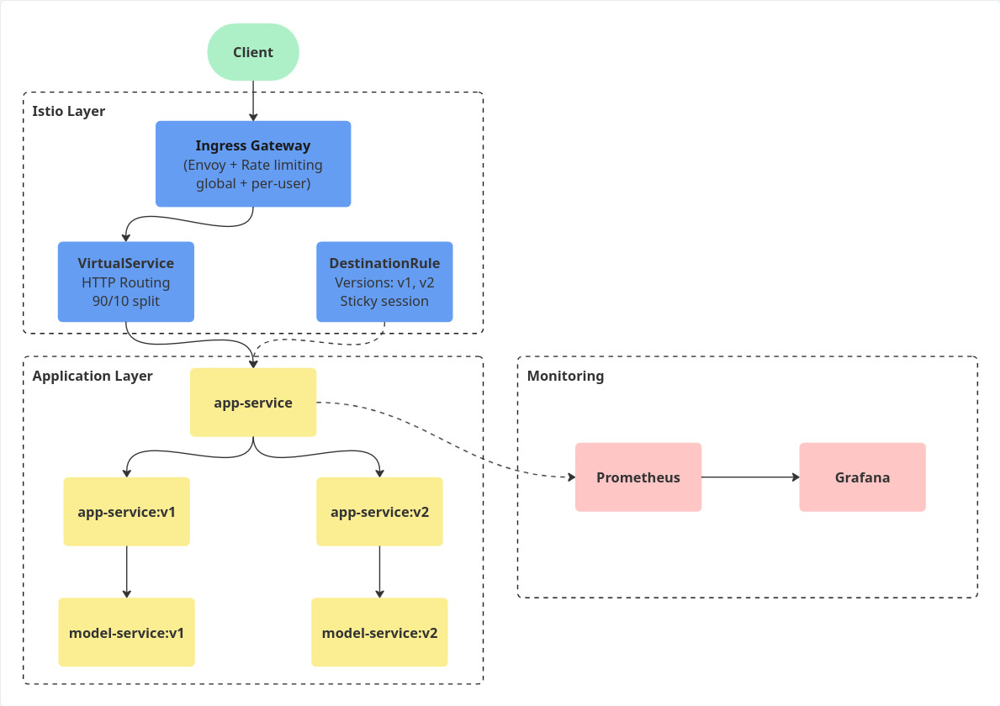
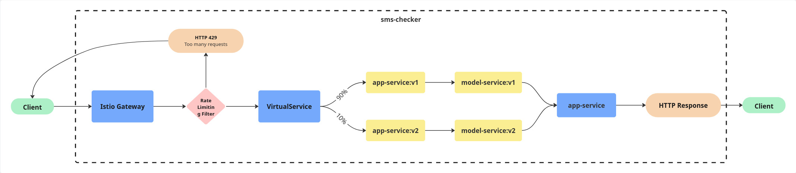
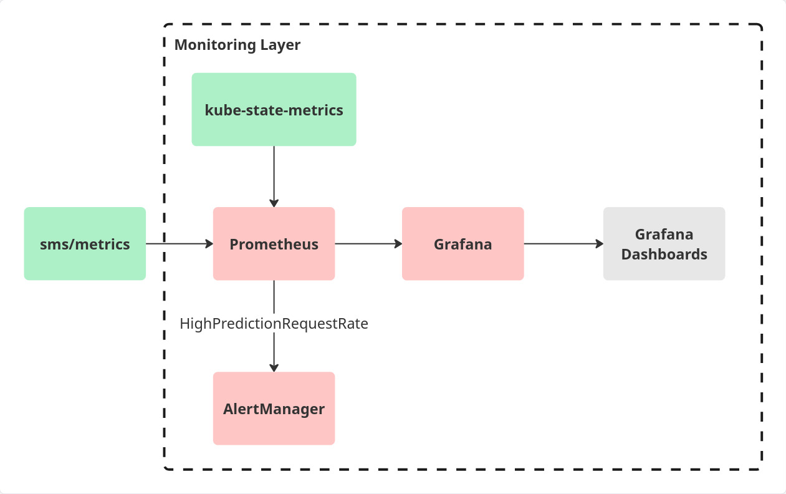

# Deployment Documentation - Team 18

This document describes the structure and the data flow of our final deployment.

## 1. Deployment Structure

Our system consists of a frontend (`app-service`) and a backend (`model-service`), which support two versions ('v1' stable, 'v2' canary) for continuous experimentation, and Istio routing components, including `Gateway`, `VirtualService`, and `DestinationRule`, which support the traffic management through our deployment. 

We also include Prometheus and Grafana in order to monitor specific metrics and create dashboards to compare the two versions.

As our *Additional Use Case*, we implemented global and per-user rate limiting on the Istio IngressGateway using the Envoy Global.

The structure of the deployment can be seen in Figure 1.

Figure 1 - Diagram of the deployment structure

## 2. Deployment Flow

A typical user request flows through the system as follows:

1. **Client -> Istio Gateway**  
   The user sends an HTTP request.

2. **Istio Gateway -> Rate Limiting Filter**  
   The `Istio Gateway` receives the request and evaluates it against the rate-limit rules. If the request exceeds the limit, **HTTP 429** is returned.

3. **Istio Gateway -> VirtualService**  
   If the request passes, the routing rules defined in `VirtualService` are applied.

4. **VirtualService -> app-service**  
   The `VirtualService` decides whether the request should be routed to `v1` or `v2` of `app-service`, based on its configured 90/10 weights.

5. **app-service -> model-service**  
   The request flows from `app-service` to `model-service`. Sticky session ensures the user stays on the same version: if the request is sent to `app-service-v1`, then the next requests will be on `app-service-v1` as well.

6. **model-service -> app-service -> Client**  
   The `model-service` returns the prediction to the `app-service`, which constructs the HTTP response and sends it back to the client via the same path **(app → VirtualService → Istio Gateway → Client)**.

A diagram for this request flow can be seen in Figure 2.

Figure 2 - Diagram of the request flow

## 3. Dynamic Routing

The decision of dynamic routing is done in `VirtualService`. We have a 90/10 split, which means that 90% of requests go to the stable version `v1`, and 10% go to the canary version `v2`. Then, the traffic is directed to subsets defined in the `DestinationRule`.

## 4. Continuous Experimentation

For the continuous experimentation, we proposed a new feature: accuracy, which measures the percentage of correct and incorrect guesses made by the user. The decision on weather to implement this feature or not will be based on the results of the A/B testing.

For testing, we will have two versions:
- stable version (v1) which doesn't show the new feature;
- canary version (v2) which has the accuracy feature.

90% of the users will be routed to the stable version, and 10% will be routed to the canary version. In this case, we also use Sticky Session to ensure that a user remains on the same version for the entire duration of the session.

## 5. Monitoring

In order to observe the health and behaviour of our deployment, we use monitoring tools such as Prometheus and Grafana. These also support the continuous experimentation for the canary and stable versions.

The deployment uses the `kube-prometheus-stack`, which provides Prometheus for the collection of metrics, Grafana for visualisation, and `kube-state-metrics` for showing the state of the Kubernetes components. The monitoring layer can be seen in Figure 3.

Prometheus continuously scrapes metrics from the app-service through the `sms/metrics` endpoint. In our deployment, 3 metrics are exported:
- `num_of_predictions` (counter) - this metric shows the total number of predictions handled by the system;
- `correct_predictions_ratio` (gauge) - this metric shows the fraction of predictions where the user correctly predicted the model response;
- `predict_latency_seconds` (histogram) - this metric shows how long it took to get a response from the model service in seconds.

We also use Alert Manager, which sends an alert of high traffic to the user if the threshold is exceeded (2 requests/min right now, low number for testing purposes).

The metrics are then processed and visualised with Grafana, which creates two dashboards: one which shows the basic metrics, and one to support the decision process for the continuous experimentation.

Figure 3 - Diagram of the Monitoring Layer

## 6. Additional Use Case

As our additional Istio use case, we implemented **global and per-user rate limiting** on the Istio IngressGateway using the Envoy Global Rate Limit Service.

### Applied Limits

We defined two independent limits:

1. **Global limit**: Accepts only 10 requests per minute, across all users. After 10 requests, returns an error. This limit protects the system from sudden surges or accidental flooding.

2. **Per-user limit**: Accepts only 5 requests per minute, per user. This limit ensures fairness and prevents a single user from overwhelming the system. Since this limit applies to each user individually, one user surpassing the limit shouldn't affect the others.

### Placement in the Deployment Flow

Rate limiting happens before routing decisions (90/10 split) are applied:

1. Request enters the `Istio IngressGateway`.
2. The Envoy filter checks the request against the defined rate-limit policies.
3. If the request exceeds the limit:
   - Envoy returns error **HTTP 429 Rate Limited**.
   - The request never reaches the VirtualService.
4. Otherwise, the request continues normally to the `VirtualService`, where the rest of the flow continues.

### Purpose and Benefits

This additional use case provides several benefits to our deployment:

- Protects the application from overload.
- Ensures per-user fairness.

## 7. External Access

- **hostnames**: stable.team18.nl
- **ports**: 80
- **paths**: `/sms` - main web interface of the application
