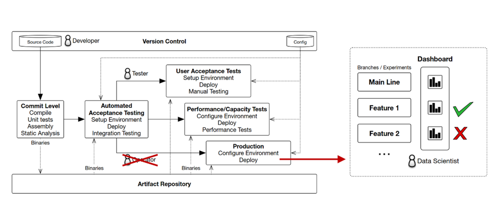
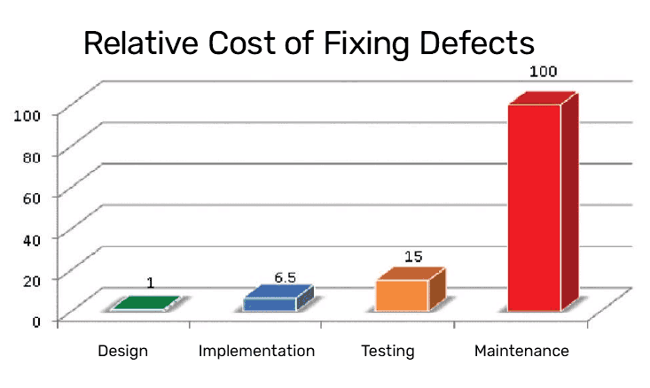

## Extenstion Proposal
This extension proposal advocates for the inclusion of **Automated Acceptance Testing** in the release pipeline. 
### Motivation

When looking at a typical delivery pipeline as presented in the lectures, we see several techniques we implemented in our project to detect errors in our system (Build on commit, Continuous Experimentation). However, one that is severely lacking is automated testing. As it stands right now, a build that had only manual testing might be deployed to a fraction of the real userbase. This makes it more likely that bugs are only discovered late in the Software Development Life Cycle, making them much more costly.
[[1]](#1)

Automated unit tests are a part of the solution, but since these are less interesting from a release engineering perspective (running them would be a oneliner in the Github Workflow), this extension proposal explores Automated Acceptance testing.

### Automated Acceptance Testing
The goal of Automated Acceptance Testing is to verify whether a system meets the requirements of the client[[2]](#2). This is done by simulating user interactions in a test environment that closely resembles a production deployment.

A github workflow should first set up a lightweight kubernetes cluster. The *Kind* tool is recommended for this, since it is more optimized for CI workloads than Minikube [[3]](#3). The application can then be deployed to this cluster with Helm, using the images that were built in the *Build* workflow. An example following the general approach described here can be found in a blog post by Marko Mudrinic[[4](#4).

The automated simulation of user interactions can be achieved with Selenium[[2]](#2). Tests should cover typical use cases of the app. If any of its tests fail, the entire workflow should fail and the release/merge halted.

Depending on need and available resources, an organization could choose to run this workflow either at every merge to the main branch or at every release.
### Verifying effectiveness
To verify the effectiveness of Automated Acceptance Testing, we should analyze the results of the proposed Github Workflow over time. Every time it fails due to an error in the code, this can be considered a success. This fault would otherwise have been detected in manual testing or in production, which would have been costlier.

For a true apples-to-apples comparison, we could run the workflow only for 50% of releases. Over time, we should then see a trend in the amount of manually detected bugs in the tested vs. untested releases.
### Risks and drawbacks
The first drawback is the large resource usage this extra pipeline step would take. While Kind is more efficient than Minikube, it still takes significant time in the pipeline to set up an entire kubernetes cluster and deploy the application. This could be mitigated by using a remote cluster the CI server connects to, instead of spinning up a new one every run. This would come at the cost of added complexity.
Tests using Selenium also run quite a bit slower than unit and integration tests. This has environmental and financial consequences, since Github pipeline time can add up to be quite expensive.

Automated acceptance testing also adds maintenance costs. When functionality is added, tests need to be created and potentially modified.

Another potential issue is developer over reliance. Knowing their code will be tested automatically, developers may be less critical of their own code and forego manual testing, even though automated tests may have blind spots as well.

<a id="1">[1]</a> Dawson, Maurice & Rahim, Emad & Brewster, Stephen. (2010). Integrating Software Assurance into the Software Development Life Cycle (SDLC). Journal of Information Systems Technology and Planning. 3. 49-53. 
<a id="2">[2]</a> https://www.selenium.dev/documentation/test_practices/testing_types/
<a id="3">[3]</a> https://www.devzero.io/blog/minikube-vs-kind-vs-k3s
<a id="4">[4]</a> https://www.containerdays.io/blog/running-kubernetes-in-the-ci-pipeline/
<a id="5">[5]</a> https://www.selenium.dev/documentation/grid/
